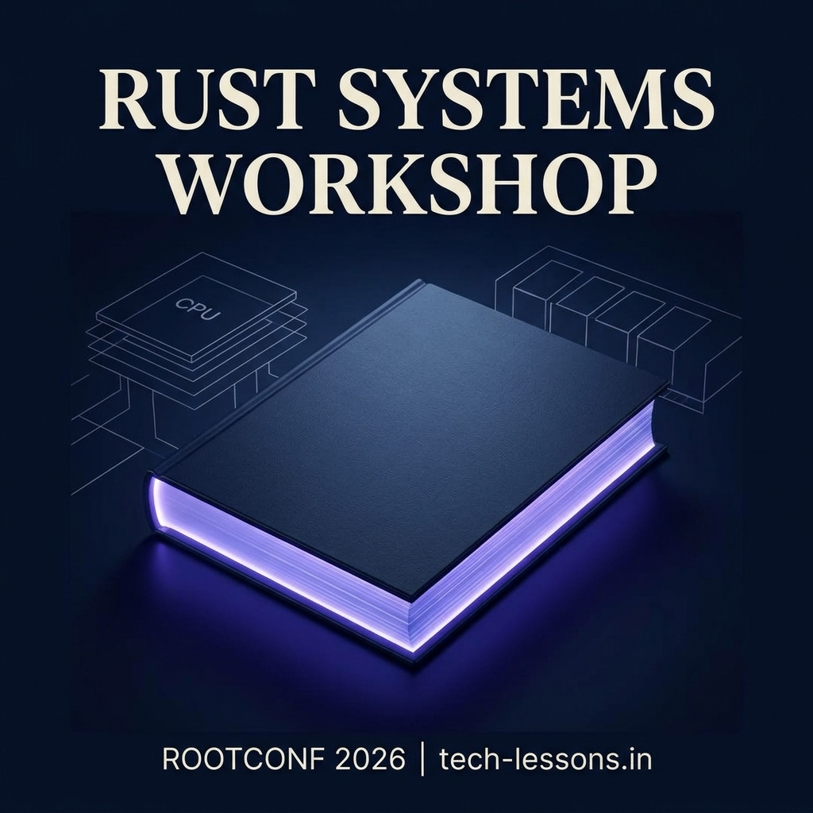

# Rust Workshop 2026: The Mechanics of Memory & Safety



Welcome to the **Rust Systems Workshop**, a 14-stage deep dive into the engineering of memory-safe, high-performance systems. Originally presented at **RootConf 2026**, this repository serves as an interactive, presentation-style resource for mastering Rust's unique memory model.

### 🔗 [Live Presentation](https://tech-lessons.in/rust-workshop-2026/)

---

## 🏗 The Architecture
This workshop is built with a focus on immersive, "book-like" interactions that facilitate deep focus on technical concepts.

- **Engine**: [Astro](https://astro.build/) for high-performance static delivery.
- **Interface**: [React PageFlip](https://github.com/Nodlik/react-pageflip) for a premium, dual-page spread experience.
- **Styling**: Vanilla CSS with a bespoke "Parchment & Navy" design system.
- **Responsiveness**: Fully optimized for mobile viewports (e.g., iPhone XR) with vertical internal scrolling for long technical content.

---

## 📚 Curriculum Overview

The workshop journeys through the entire lifecycle of an in-memory cache, optimizing for zero-cost abstractions across 14 intensive stages:

1.  **Foundations**: In-Memory Caching & Basic Ownership.
2.  **Primitive Obsession**: The NewType Pattern & Type Safety.
3.  **Generic Abstractions**: Writing Polymorphic Cache Implementations.
4.  **Mutation vs Aliasing**: Understanding the 1-Writer-Only constraint.
5.  **Interior Mutability**: Moving Borrow Checking to Runtime.
6.  **Fearless Concurrency**: Thread-Safe Wrappers and Inner Locking.
7.  **Reference Counting**: Mastering the Arc Smart Pointer.
8.  **Advanced Memory**: The Pointer Trick & Lock-Free Access.
9.  **Scale and Sharding**: Multi-Processor Memory Contention.
10. **Real-World Latency**: Zero-Copy References and Cache Expiration.
11. **Atomic Mechanics**: Memory Ordering & Atomic Ref Counting.
12. **Instruction Optimization**: MESI Protocol and False Sharing.
13. **Graceful Termination**: Type-State Driven Resource Management.
14. **Final Integration**: Building the Production-Ready Cache.

---

## 🚀 Getting Started

To run this workshop locally:

1.  **Install dependencies**:
    ```bash
    npm install
    ```

2.  **Start the development server**:
    ```bash
    npm run dev
    ```

3.  **Build for production**:
    ```bash
    npm run build
    ```

---

## 🚢 Deployment

This project is configured for automated deployment to **GitHub Pages** via the included workflow.
To trigger a deployment, push a new version tag:

```bash
git tag v1.1.0
git push origin v1.1.0
```

---

*Presented by [Sarthak Makhija](https://tech-lessons.in/), RootConf 2026*
